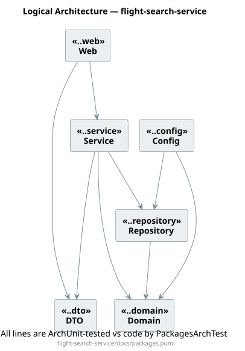
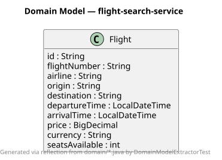
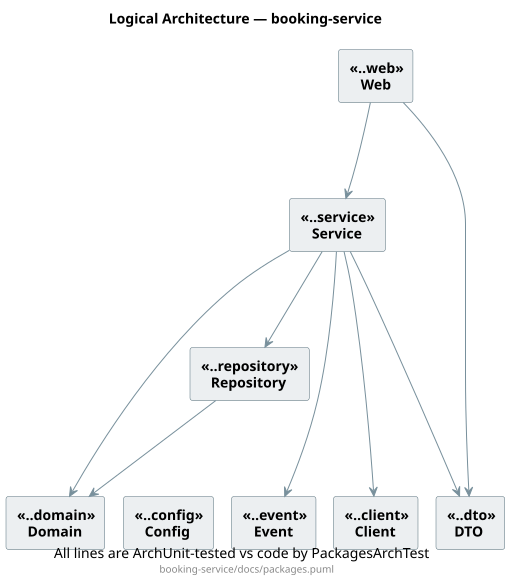
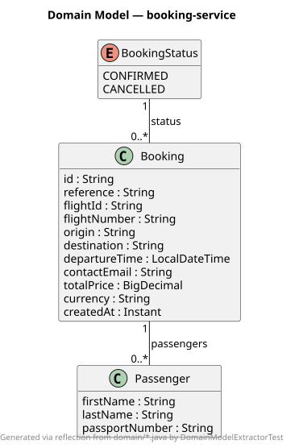

# AirGo — Airline Ticketing Platform

A monorepo demonstrating an online airline ticketing platform built as **Spring Boot
microservices** with a **Next.js** frontend. It covers the full journey — **search flights →
book → pay → manage** for travellers — plus a **role-based admin console** with **flight CRUD
(soft-delete)**, **backend-paginated fuzzy search**, and a **realtime booking feed**, all
behind an **API gateway with JWT auth**.

> Everything runs locally with **zero external infrastructure**. Each service uses an
> in-memory **H2** database by default. Postgres, Elasticsearch, Kafka and Grafana are
> wired in as **profiles / placeholders** you can enable later without re-architecting.

## Repository layout

```
airline/
├── backend/                     # Maven multi-module build
│   ├── pom.xml                  # parent aggregator (Spring Boot 4.1 / Java 25)
│   ├── airline-bom/             # Bill of Materials — one place for dependency versions
│   ├── airline-common/          # shared: error handling, DTOs, JWT utilities
│   ├── flight-search-service/   # flight catalog + search API            (:8081)
│   │   └── docs/                #   packages.puml + generated/DomainModel.puml
│   ├── booking-service/         # create/read bookings                   (:8082)
│   │   └── docs/                #   packages.puml + generated/DomainModel.puml
│   └── api-gateway/             # single entry point + JWT auth          (:8080)
├── frontend/                    # Next.js + React + TypeScript + Tailwind (:3000)
├── infra/                       # docker-compose + Grafana placeholders (not required)
├── scripts/                     # start-all / stop-all / smoke-test
└── docs/                        # architecture notes
```

## Architecture

```
             ┌───────────────┐
Browser ───▶ │  api-gateway  │ :8080   (JWT auth, CORS, routing)
 (Next.js)   └──────┬────────┘
                    │  /api/flights/**            /api/bookings/**
             ┌──────▼───────────┐          ┌──────────▼──────────┐
             │ flight-search    │ :8081    │ booking-service     │ :8082
             │  (H2 catalog)    │◀─────────│  validates flight    │
             └──────────────────┘  REST    └─────────────────────┘
```

- The frontend talks **only** to the gateway.
- The gateway validates the JWT on `/api/**` (except `/api/auth/login`) and forwards the
  authenticated username downstream via the `X-Auth-User` header.
- `booking-service` calls `flight-search-service` over REST to validate the flight and
  price the booking, then emits a `BookingCreated` domain event (logged now; Kafka later).

## Prerequisites

- Java 25 (backend), Maven wrapper included (`./mvnw`)
- Node.js 20+ / npm (frontend)
- Docker (only if you later start `infra/docker-compose.yml`)

## Quick start

### Option A — one command
```bash
./scripts/start-all.sh      # builds backend, starts 3 services + frontend dev server
```
Then open http://localhost:3000 and sign in as a **traveller** (any username with password
**demo**, e.g. `alice`/`demo`) to search, book, pay for and manage trips — or as **admin /
admin** for the management console (flight CRUD, fuzzy search, and the live booking feed).

Stop the backend services with:
```bash
./scripts/stop-all.sh
```

### Option B — manual (separate terminals)
```bash
# 1) Backend
cd backend
./mvnw -q -DskipTests install
java -jar flight-search-service/target/flight-search-service-0.0.1-SNAPSHOT.jar   # :8081
java -jar booking-service/target/booking-service-0.0.1-SNAPSHOT.jar               # :8082
java -jar api-gateway/target/api-gateway-0.0.1-SNAPSHOT.jar                       # :8080

# 2) Frontend
cd frontend
npm install
npm run dev                                                                       # :3000
```

## Try the API directly

```bash
./scripts/smoke-test.sh        # 401 → login → search → book → fetch
```

Or by hand:
```bash
# Login → JWT
TOKEN=$(curl -s -X POST http://localhost:8080/api/auth/login \
  -H 'Content-Type: application/json' \
  -d '{"username":"demo","password":"demo"}' | jq -r .token)

# Search (AMS → LHR today)
curl -s "http://localhost:8080/api/flights?origin=AMS&destination=LHR&date=$(date +%F)" \
  -H "Authorization: Bearer $TOKEN"

# Book
curl -s -X POST http://localhost:8080/api/bookings \
  -H "Authorization: Bearer $TOKEN" -H 'Content-Type: application/json' \
  -d '{"flightId":"KL1007-'"$(date +%F)"'","contactEmail":"a@b.com",
       "passengers":[{"firstName":"Ada","lastName":"Lovelace"}]}'
```

Seeded routes (7 days from today) span Europe, the Atlantic, the Middle East/Asia and the
southern hemisphere — e.g. `AMS↔LHR`, `AMS↔JFK`, `LHR→DEL`, `AMS→DXB`, `SIN→SYD`. Admins can
also add flights at runtime, and a global catalog of ~75 airports powers the searchable
From/To dropdowns.

## Dependency hygiene (BOM)

All backend dependency versions are centralised in [`airline-bom`](backend/airline-bom/pom.xml)
and imported by the parent POM. Bumping a version in one place updates every service,
minimising the number of vulnerability fixes needed over time.

## Architecture guardrails (living diagrams)

Adopted from [victorrentea/petclinic](https://github.com/victorrentea/petclinic) — diagrams are
generated from / checked against the code, so they can't silently drift:

- **`PackagesArchTest`** (ArchUnit) keeps each service's `docs/packages.puml` in sync with its
  real package structure: cross-package dependencies must match the diagram, and the diagram's
  package set must equal the code's subpackages exactly.
- **`DomainModelExtractorTest`** regenerates each service's `docs/generated/DomainModel.puml`
  from the `domain` package via reflection (classes, enums, attributes, associations with
  cardinalities).

Run them with `./mvnw -pl flight-search-service,booking-service test`. See
[docs/ARCHITECTURE.md](docs/ARCHITECTURE.md#architecture-guardrails-living-code-coupled-diagrams)
for the full explanation and the portable "gravity" layout recipe.

### Rendered diagrams

The SVG views below are generated from the committed PlantUML sources. Click any diagram to
open it full size.

#### Flight search service

[](backend/flight-search-service/docs/packages.svg)

[](backend/flight-search-service/docs/generated/DomainModel.svg)

#### Booking service

[](backend/booking-service/docs/packages.svg)

[](backend/booking-service/docs/generated/DomainModel.svg)

Regenerate the SVGs with `./scripts/render-diagrams.sh` (install PlantUML with
`brew install plantuml`, or set `PLANTUML_JAR=/path/to/plantuml.jar`). In VS Code, the
**PlantUML** extension by jebbs provides a live preview: open a `.puml` file and press `Alt+D`
(`Option+D` on macOS).

## Enabling the "later" integrations

| Capability      | How to enable                                                                 |
|-----------------|-------------------------------------------------------------------------------|
| Postgres        | `docker compose -f infra/docker-compose.yml up -d postgres`, uncomment the driver in the service pom, run with `--spring.profiles.active=postgres` |
| Elasticsearch   | start `elasticsearch`, uncomment the ES starter in `flight-search-service`, run with the `elasticsearch` profile |
| Kafka events    | start `kafka`, uncomment `spring-kafka` + the `KafkaBookingEventPublisher`, run booking with the `kafka` profile |
| Grafana         | `docker compose -f infra/docker-compose.yml up -d grafana` → http://localhost:3300 |
| Notification svc| add a new module that consumes `booking-events` from Kafka                     |

See [docs/ARCHITECTURE.md](docs/ARCHITECTURE.md) for the roadmap and design notes.

## Ports

| Service               | Port |
|-----------------------|------|
| api-gateway           | 8080 |
| flight-search-service | 8081 |
| booking-service       | 8082 |
| frontend (Next.js)    | 3000 |
| Grafana (optional)    | 3300 |

## Documentation

Full docs live under [`docs/`](docs) and per-module `README.md` files. Start at the
[documentation index](docs/README.md). Highlights:

| Doc | What |
|-----|------|
| [docs/README.md](docs/README.md) | Index / map of all documentation |
| [docs/ARCHITECTURE.md](docs/ARCHITECTURE.md) | Design, request flow, guardrails, roadmap |
| [docs/API.md](docs/API.md) | Every gateway endpoint, requests/responses, errors |
| [backend/README.md](backend/README.md) | Modules, build, profiles (+ per-module READMEs) |
| [frontend/README.md](frontend/README.md) | Next.js app: screens, API client, auth |
| [infra/README.md](infra/README.md) | Postgres/ES/Kafka/Grafana placeholders |
| [scripts/README.md](scripts/README.md) | start / stop / smoke-test helpers |
